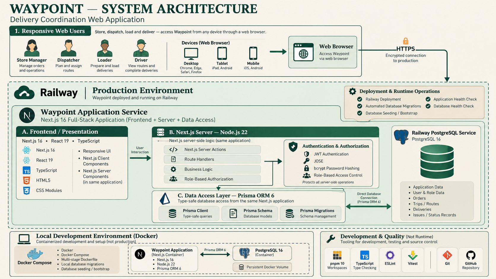

<p align="center">
  
</p>

# Waypoint

Waypoint is a responsive, role-based delivery operations platform for the Tech-Triathlon 2026 Hackathon. It connects Store Managers, Dispatchers, Loaders, and Drivers through one auditable workflow: order submission, constraint-aware planning, loading, delivery, receipt confirmation, and issue resolution.

## Contents

- [Product overview](#product-overview)
- [Technology stack](#technology-stack)
- [Architecture](#architecture)
- [Quick start with Docker](#quick-start-with-docker)
- [Demo accounts](#demo-accounts)
- [Judge walkthrough](#judge-walkthrough)
- [Configuration](#configuration)
- [Development and validation](#development-and-validation)
- [Design departures and scope notes](#design-departures-and-scope-notes)
- [Production deployment](#production-deployment)

## Product overview

Waypoint provides four purpose-built workspaces:

| Role | Core responsibilities |
| --- | --- |
| Store Manager | Submit outlet orders, monitor status, confirm receipts, review issues, and receive notifications |
| Dispatcher | Generate feasible plans, assign drivers, record deferrals, publish plan versions, monitor execution, and resolve exceptions |
| Loader | Review the trip queue, verify loading order and reefer readiness, record actual quantities, report loading issues, and confirm hand-off |
| Driver | Review an assigned trip, start and complete stops, record delivery outcomes, and reconcile offline records |

Key capabilities include:

- Constraint-aware assisted allocation across weight, volume, temperature, vehicle access, depot, brand, district, workshop state, and trip-count rules.
- Versioned delivery plans with downstream re-verification when a published plan changes.
- Server-confirmed order, loading, delivery, receipt, issue, notification, and audit records.
- Driver offline-operation and conflict-review states.
- Responsive desktop and phone experiences, with phone-focused Loader and Driver workflows.
- Idempotent demonstration data that supports a repeatable four-role walkthrough.

The main order lifecycle is:

```text
Submitted -> Confirmed -> Allocated -> Loaded -> Out for delivery -> Delivered
```

Issue cases use:

```text
Reported -> Acknowledged -> Under review -> Resolved <-> Reopened
```

## Technology stack

| Layer | Technology |
| --- | --- |
| Frontend | Next.js 16, React 19, TypeScript, CSS Modules, Lucide icons |
| Application backend | Next.js Server Components, Server Actions, and Route Handlers on Node.js 22 |
| Data access | Prisma ORM 6 |
| Database | PostgreSQL 16 |
| Authentication | Signed JWT session cookies with JOSE and bcrypt password hashing |
| Testing | Vitest and ESLint |
| Packaging | pnpm 10 workspaces |
| Deployment | Docker, Docker Compose, health checks, and automated Prisma migrations |

## Architecture

The frontend and application backend run in one Next.js service. PostgreSQL runs as a separate service and is reachable only through the internal Docker network by default.

<p align="center">
  
</p>

<p align="center"><em>Waypoint production, application, data, local-development, and quality architecture.</em></p>

Submission documentation:

- [System architecture](docs/Waypoint_System_Architecture.pdf)
- [Data model](docs/Waypoint_Data_Model.pdf)
- [AI tool disclosure](docs/Waypoint_AI_Tool_Disclosure.pdf)

## Quick start with Docker

### Prerequisites

- Docker Desktop, Docker Engine, or another Docker Compose-compatible runtime
- Git
- Ports `3001` and `5433` available, or alternative ports configured in `.env`

### 1. Clone and configure

```powershell
git clone <repository-url>
Set-Location <repository-folder>
Copy-Item .env.example .env
```

Generate a secure session secret in PowerShell:

```powershell
$sessionBytes = New-Object byte[] 32
[Security.Cryptography.RandomNumberGenerator]::Create().GetBytes($sessionBytes)
[Convert]::ToBase64String($sessionBytes)
```

Set the generated value as `SESSION_SECRET` in `.env`. For any non-local environment, also replace `POSTGRES_PASSWORD` with a strong unique password.

### 2. Start the complete stack

```powershell
docker compose up -d --build
```

This single command:

1. Starts PostgreSQL and waits for its health check.
2. Applies all committed Prisma migrations.
3. Seeds the idempotent demonstration dataset when `SEED_DEMO_DATA=true`.
4. Starts the optimized Next.js production server.
5. Enables application and database health checks.

### 3. Verify the deployment

```powershell
docker compose ps
curl.exe -fsS http://localhost:3001/api/health
```

Open [http://localhost:3001](http://localhost:3001). A healthy API response reports `status: "ok"` and `database: "connected"`.

## Demo accounts

Choose the matching role on the sign-in screen before entering an account.

| Role | Email | Password |
| --- | --- | --- |
| Store Manager (Fresh) | `store@waypoint.demo` | `Store123!` |
| Dispatcher | `dispatcher@waypoint.demo` | `Dispatch123!` |
| Loader | `loader@waypoint.demo` | `Loader123!` |
| Driver | `driver@waypoint.demo` | `Driver123!` |

Additional brand-specific Store Manager accounts:

| Brand | Email | Password |
| --- | --- | --- |
| Style | `style@waypoint.demo` | `Style123!` |
| Tech | `tech@waypoint.demo` | `Tech123!` |

These credentials are for judging and local demonstration only. Do not use them in a production environment.

## Judge walkthrough

The seed creates a realistic Peliyagoda delivery day with allocated, loading, loaded, and deferred work. Complete the walkthrough in order; sign out before switching roles.

1. **Confirm the planning decision as Dispatcher.** Sign in as `dispatcher@waypoint.demo`. Open **Plan** to review the service-day queue and the hard-rule checks used by assisted planning. Open **Live Board** to inspect the published plan and confirm that `VEH036` is loaded and assigned to the seeded Driver. Open **Deferral Log** to review the capacity-based deferral and its recorded reason.
2. **Inspect and complete loading as Loader.** Sign in as `loader@waypoint.demo`. Open **Trip queue** and review the Fresh-priority and temperature indicators. Open the in-progress trip for `VEH012`, complete its remaining quantities, and confirm the load. Open **Loading issues** to inspect the documented shortfall on `VEH036`; the issue is shared with Dispatcher and Store views.
3. **Complete the delivery as Driver.** Sign in as `driver@waypoint.demo` on a phone-sized viewport. From **Today**, open the assigned `VEH036` trip, review the stop and delivery window, start the trip, open the active stop, enter the receiver name, and confirm delivery. Visit **Sync** to verify that the delivery record is acknowledged or to review any queued/conflicting offline operation.
4. **Confirm receipt as Store Manager.** Sign in as `store@waypoint.demo`. Review **Notifications** for the documented loading shortfall, then open **Receive**. Select the delivered order, compare expected and received quantities, add a note if needed, and confirm the receipt. The result is persisted with the Store Manager identity and timestamp.
5. **Close the operational loop as Dispatcher.** Sign back in as the Dispatcher. Open **Live Board** to see the store-verification state. Open **Needs Attention**, inspect the combined Loader, Driver, and Store evidence, and progress the issue through its lifecycle.
6. **Review degradation behavior.** On a phone-sized Driver view, use the browser network controls to go offline before recording an outcome. Restore connectivity and open **Sync** to review the pending operation and conflict handling. Loader loading issues and plan-change re-verification provide additional failure-path demonstrations.

## Configuration

The root `.env.example` documents every variable needed by Docker Compose.

| Variable | Purpose | Local default |
| --- | --- | --- |
| `POSTGRES_USER` | PostgreSQL user | `waypoint` |
| `POSTGRES_PASSWORD` | PostgreSQL password | `waypoint` |
| `POSTGRES_DB` | PostgreSQL database | `waypoint` |
| `POSTGRES_PORT` | Host port for PostgreSQL | `5433` |
| `APP_PORT` | Host port for the web application | `3001` |
| `DATABASE_URL` | Host-side Prisma connection URL | PostgreSQL on `127.0.0.1:5433` |
| `SESSION_SECRET` | Secret used to sign eight-hour sessions | Replace before use |
| `SEED_DEMO_DATA` | Run the idempotent judge/demo seed during startup | `true` |

Inside Docker, Compose supplies an internal `DATABASE_URL` that connects the application to `postgres:5432`. Never commit `.env` or production credentials.

Useful Docker commands:

```powershell
# Follow application logs
docker compose logs -f app

# Restart only the application
docker compose restart app

# Stop services while retaining database data
docker compose down
```

`docker compose down -v` also deletes the PostgreSQL volume and all local application data. Use it only when an intentional clean reset is required.

## Development and validation

For host-side development with PostgreSQL in Docker:

```powershell
docker compose up -d postgres
pnpm install
pnpm db:generate
pnpm --filter @waypoint/database exec prisma migrate deploy
pnpm db:seed
pnpm dev
```

The development server is available at [http://localhost:3000](http://localhost:3000).

Run the quality gates before submission:

```powershell
pnpm lint
pnpm test
pnpm build
docker compose build app
```

The optional registration smoke test requires a running application and dispatcher account:

```powershell
pnpm --filter @waypoint/web exec node registration-smoke.mjs
```

### Monorepo structure

```text
.
|-- apps/web/                 Next.js application and role workspaces
|-- docs/                     Architecture, data model, and AI disclosure
|-- packages/allocation/      Constraint evaluation and assisted planning
|-- packages/database/        Prisma schema, migrations, seed, and client
|-- packages/domain/          Shared domain types, labels, and catalog data
|-- compose.yaml              Complete application and database stack
|-- Dockerfile                Multi-stage production image
|-- .env.example              Safe configuration template
`-- package.json              Workspace commands
```

## Design departures and scope notes

The Hackathon build follows the Designathon's four-role workflow and visual language, with these documented implementation decisions:

- The source design did not include phone layouts for every Store Manager and Loader screen. Responsive versions preserve the same content hierarchy and actions while reflowing dense desktop layouts for smaller screens.
- Static prototype values were replaced with coherent database-backed records, timestamps, statuses, and calculated totals so cross-role state remains consistent.
- The Loader experience uses an authenticated depot-scoped terminal account. Audit records identify that terminal account and session rather than claiming unsupported individual warehouse-worker identity.
- Driver proof of delivery uses the permitted receiver-name evidence path. Photo and drawn-signature capture are not included in the current build.
- Navigation maps are illustrative; the application does not claim live turn-by-turn routing or traffic integration.
- Notifications are currently in-app. External SMS and push delivery are outside the submitted deployment.
- The checked-in seed contains a focused, repeatable delivery day. Confidential source datasets are not published in this repository.
- The current interface is English-first; Sinhala and Tamil localization are not included in this submission.

## Security and data handling

- Passwords are stored as bcrypt hashes.
- Authentication uses `HttpOnly`, `SameSite=Lax` JWT cookies; production cookies use the `Secure` flag.
- Every protected workspace verifies the authenticated role on the server.
- Store Manager access is outlet-scoped; operational staff access is depot- or assignment-scoped.
- Workflow mutations create status history, notifications, and audit records where applicable.
- PostgreSQL is bound to the local host by the supplied Compose configuration and is not exposed publicly.

## Production deployment

Before exposing the system publicly:

1. Set a strong unique `POSTGRES_PASSWORD` and `SESSION_SECRET` through the hosting platform's secret manager.
2. Set `SEED_DEMO_DATA=false` for a real operational environment. Keep it enabled only for the judging deployment that requires seeded accounts.
3. Terminate TLS through a managed ingress, Caddy, or Nginx.
4. Keep PostgreSQL private and configure automated backups and retention.
5. Run migrations as a controlled release step if deploying multiple application replicas.
6. Configure centralized logs, uptime monitoring, and error reporting.
7. Keep the deployed URL available throughout the competition review period.

## License

No open-source license has been declared. All rights are reserved unless the repository owner adds a license.
